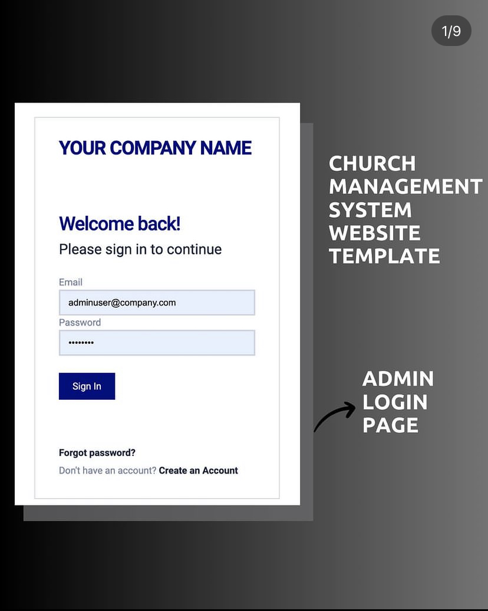
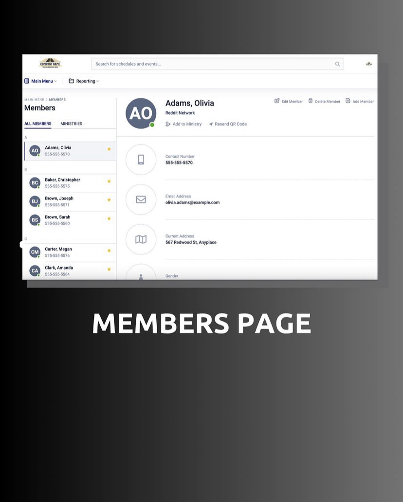
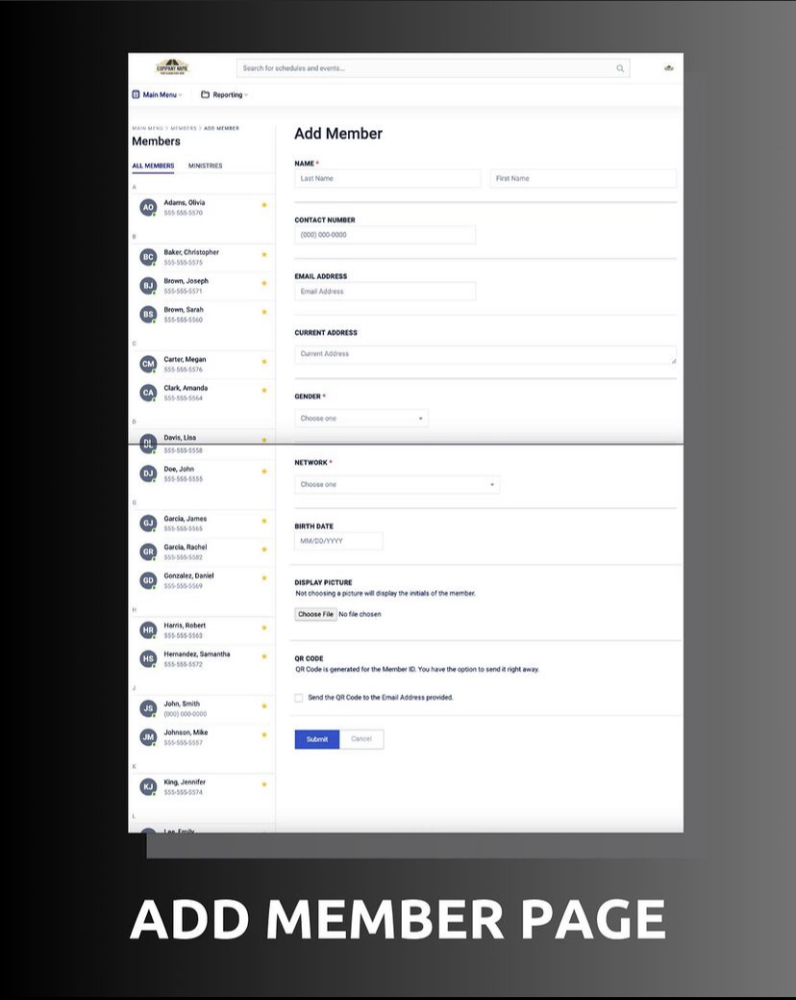
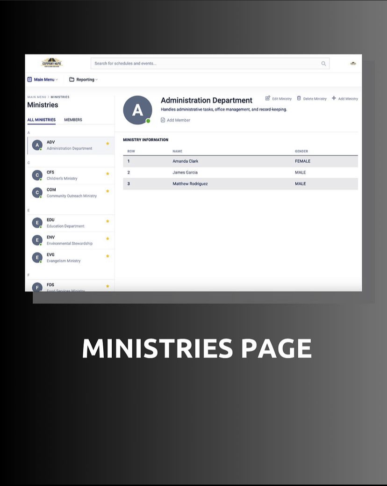
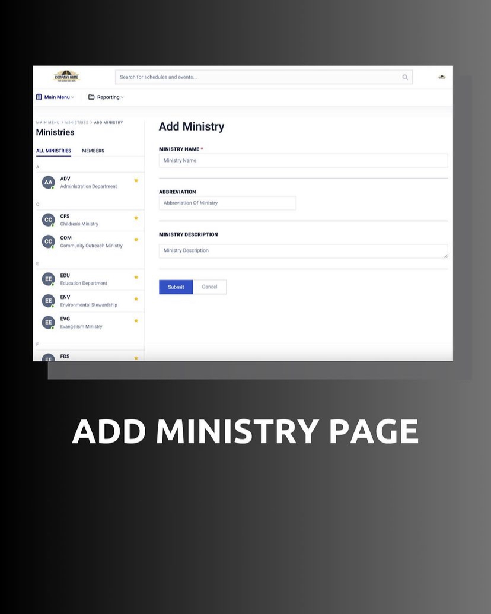
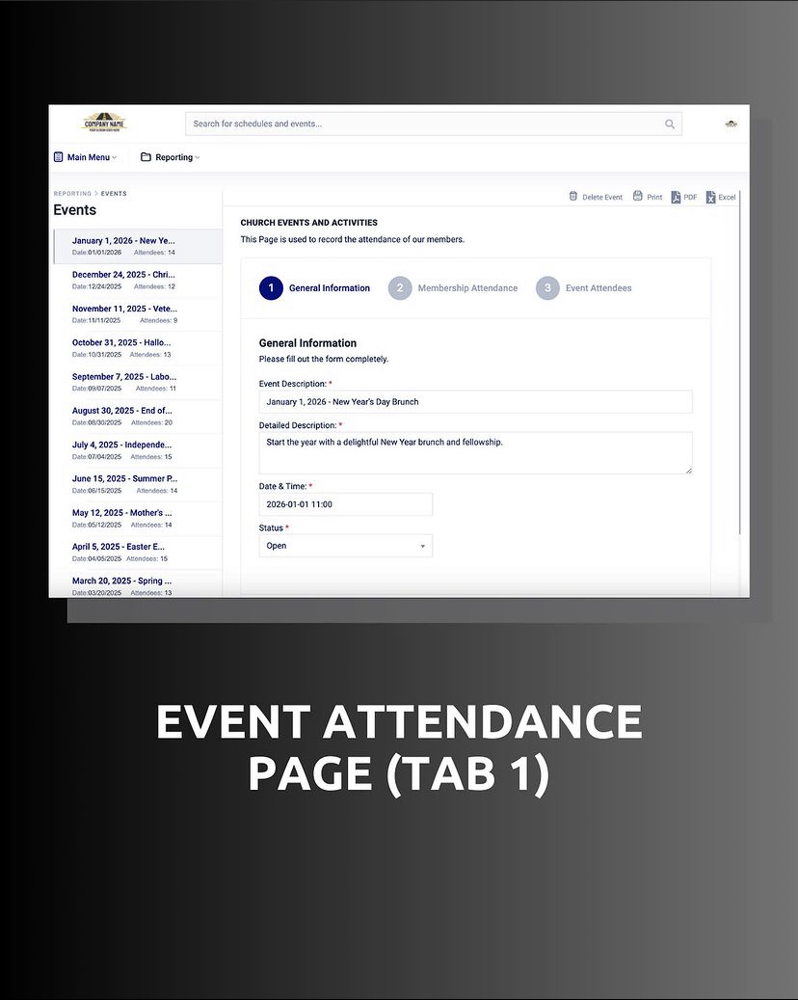
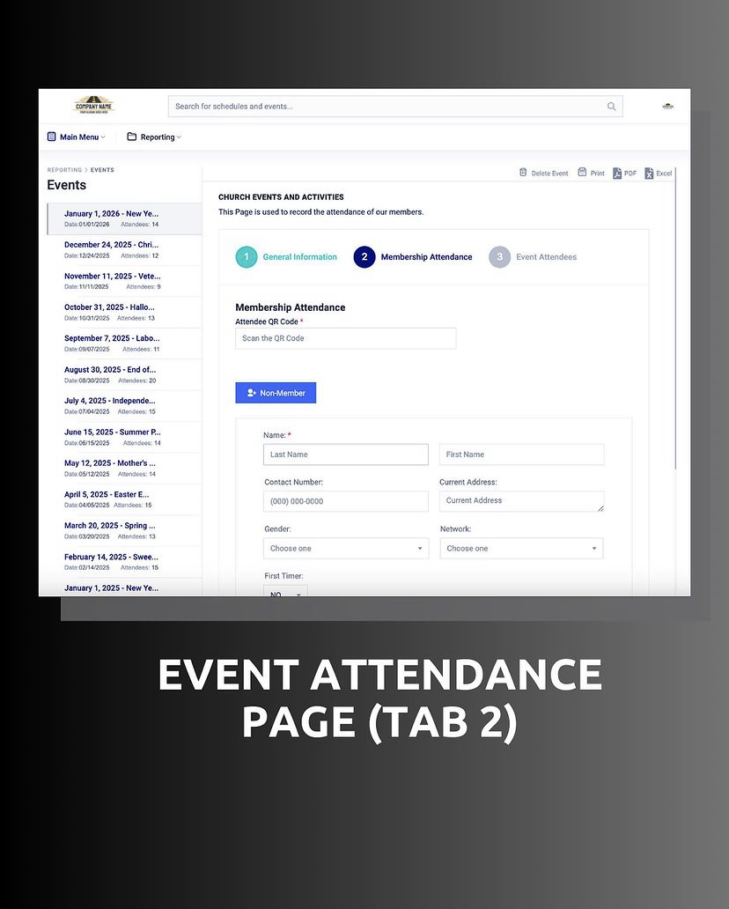
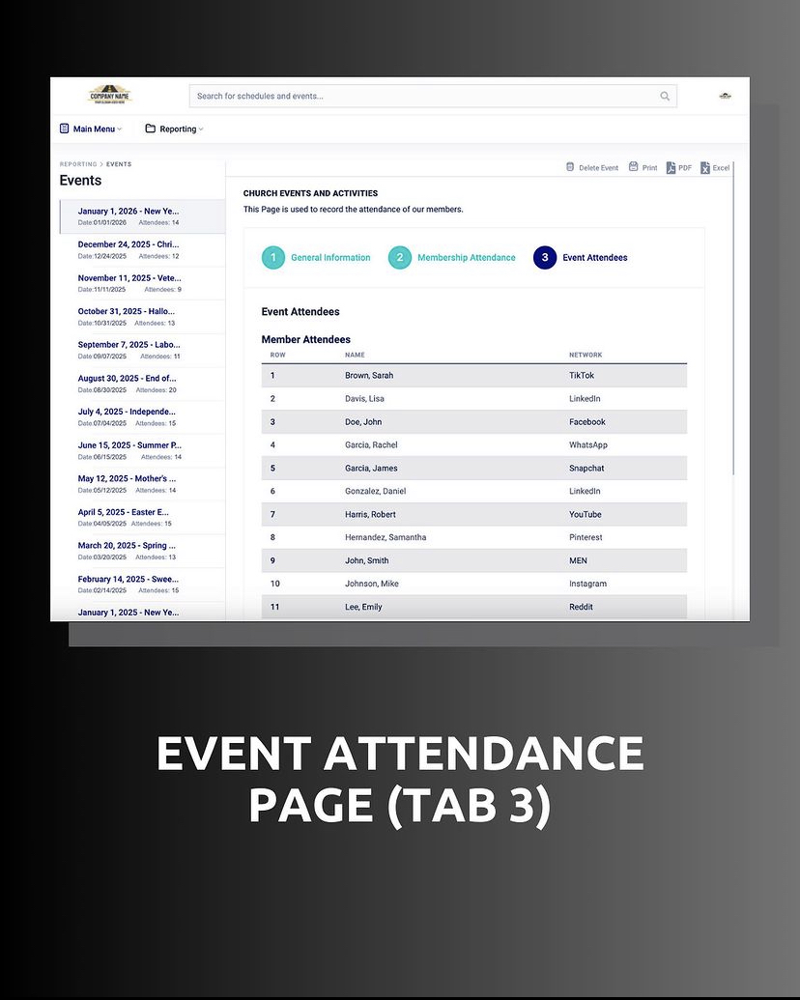

# Church-Management-System: Revolutionizing Church Administration

Welcome to the Church Management System repository, where innovation meets tradition! Our mission is to transform and automate the manual processes within our church, introducing efficiency and seamless management.

## Project Overview

Our church currently relies on manual processes for crucial tasks such as membership information, attendance tracking, and prayer requests. To propel these processes into the future, we're embarking on a journey to implement an automated Church Management System delivered in phases.

## Project Images
    
   

### Phase 1: Membership Information and Attendance System

In the inaugural phase, we've automated membership information and attendance tracking. A web application, accessible exclusively on our local church network, acts as the central hub for secure storage of membership details. Each member receives a unique Membership Identification Number and a QR Code through automated emails. This QR Code is pivotal for the Attendance System.

For the Attendance System, a dedicated computer at the church entrance equipped with a QR Code scanner facilitates effortless attendance registration. Members simply present their emailed QR Code, and the system seamlessly records their attendance.

## Future Phases

Our vision for the Church Management System extends beyond automation. We aim to automate all facets of church administration, encompassing Financial Reports, Events Organizing, News, Calendar of Activities, and more. This integrated solution aims to consolidate various church processes into a singular, efficient system.

## Tech Stack

The Church Management System is crafted with cutting-edge technologies:

- **PHP CodeIgniter:** A robust framework for seamless web application development.
- **HTML5/CSS3:** Ensuring a modern and responsive user interface.
- **Bootstrap:** Enhancing the overall design and user experience.
- **MariaDB, MySQL:** Serving as the reliable database management systems.
- **AJAX/JSON:** Facilitating seamless data exchange and enhanced user interactions.

Feel free to explore the codebase and contribute to the continuous improvement of our Church Management System. Together, we are creating a more connected and automated church community!
